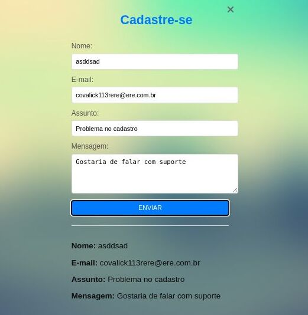

# Formulário de Contato

Esse projeto é baseado no formulário de cadastro atual do Facebook. Nele, coloquei em prática a criação de formulários em HTML e a estilização usando CSS.

O formulário de contato é uma página web simples que permite aos usuários preencher informações como nome, e-mail, assunto e mensagem. Após o envio do formulário, os dados são validados para garantir que o campo de e-mail esteja em um formato válido. Os dados enviados são exibidos em uma área abaixo do formulário.
### ✨ Tecnologias Utilziadas

- HTML5
- CSS
- JAVASCRIPT

## Como usar o Formulário de Contato

Para utilizar o formulário de contato em seu ambiente local, siga as etapas abaixo:

### Pré-requisitos

- Certifique-se de ter o Git instalado em seu computador. Se você ainda não tem o Git, pode baixá-lo e instalá-lo a partir do site oficial do Git: [git-scm.com](https://git-scm.com/).

### Passo a Passo

1. Abra o terminal ou prompt de comando no seu computador.

2. Clone este repositório para o seu sistema local usando o seguinte comando do Git:

git clone https://github.com/cortezcodar/formulario.git

### Funcionalidades

- Campo de Nome: O usuário pode digitar seu nome no campo.
- Campo de E-mail: O usuário pode inserir seu endereço de e-mail no campo.
- Campo de Assunto: O usuário pode digitar o assunto da mensagem no campo.
- Campo de Mensagem: O usuário pode escrever a mensagem no campo de texto.
- Validação de E-mail: Antes de exibir os dados, o sistema verifica se o e-mail inserido possui um formato válido.
- Exibição de Dados: Os dados preenchidos pelo usuário são exibidos em uma área abaixo do formulário após o envio.

### Implementação

O formulário foi desenvolvido utilizando as tecnologias HTML, CSS e JavaScript. Aqui estão as principais partes do código:

4. Abra o arquivo `index.html` em um navegador da web. O formulário de contato estará disponível para preenchimento.

5. Preencha todos os campos do formulário com as informações necessárias.

6. Clique no botão "Enviar".

7. Se o e-mail inserido for válido, os dados preenchidos serão exibidos em uma área abaixo do formulário.
Se o e-mail não for válido, uma mensagem de erro será exibida.

**Observação**: Lembre-se de que este formulário é apenas um exemplo básico e não inclui processamento no lado do servidor. Para um uso em produção, é recomendado implementar um tratamento adequado dos dados enviados, como enviá-los por e-mail ou armazená-los em um banco de dados seguro.

### Obrigado por visitar meu repositório!❤️